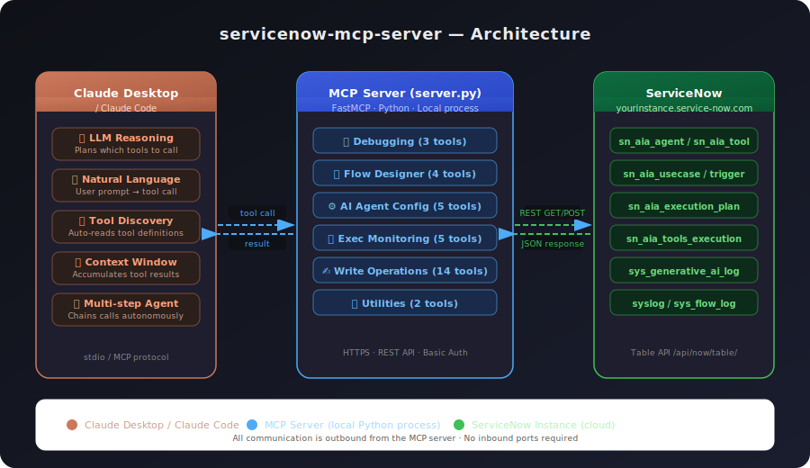
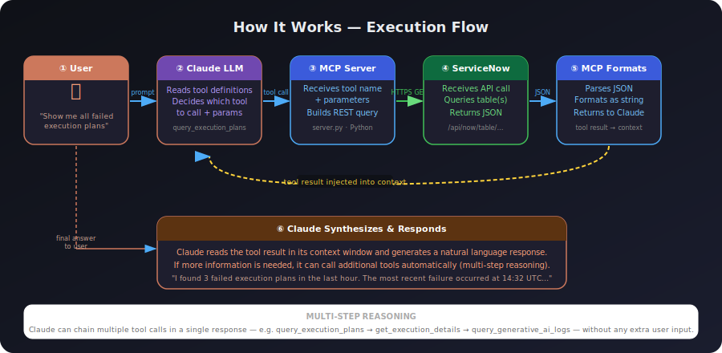
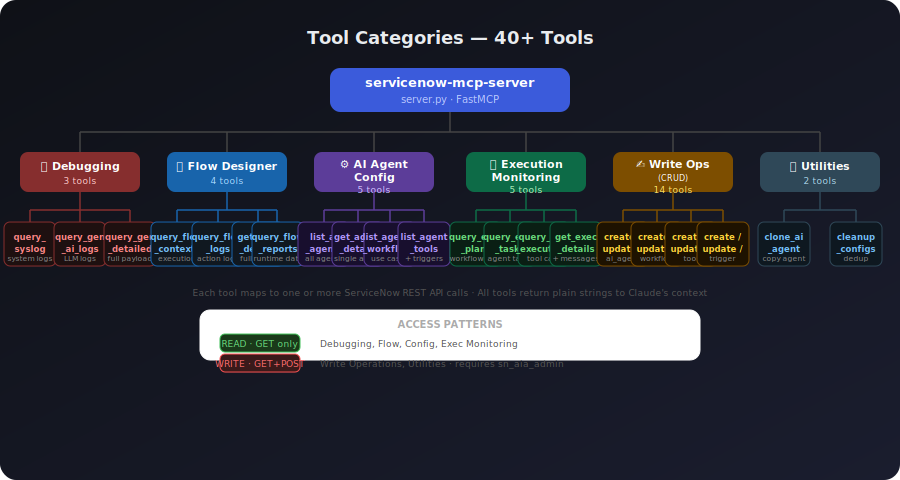
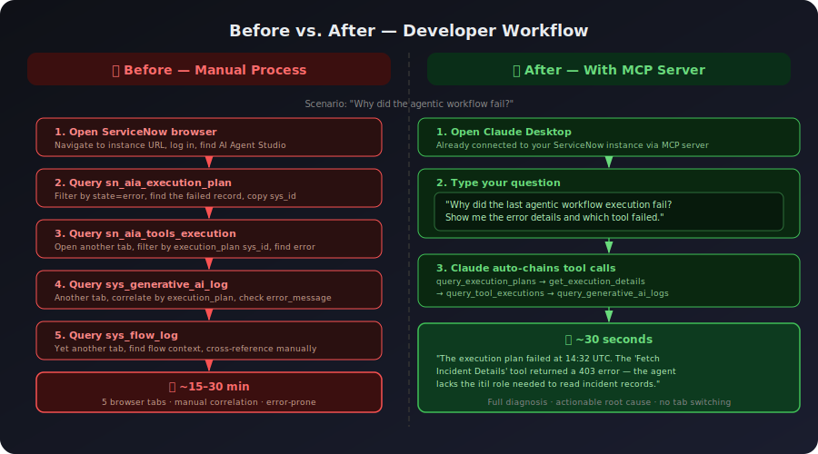

# servicenow-mcp-server

A [Model Context Protocol (MCP)](https://modelcontextprotocol.io) server that connects **Claude Desktop** to your **ServiceNow** instance — enabling natural-language management of AI Agents, Agentic Workflows, Flow Designer executions, and system logs.

---

## Diagrams

### Architecture


### How It Works — Execution Flow


### Tool Categories


### Before vs. After


---

## Background

### What is ServiceNow?

[ServiceNow](https://www.servicenow.com) is an enterprise cloud platform built around workflow automation and IT service management (ITSM). At its core, it provides a unified system of record for business processes — incidents, change requests, approvals, and more — across IT, HR, security, and customer service teams.

In recent releases (Vancouver, Washington DC, Xanadu), ServiceNow introduced **AI Agent Studio** and the **Now Assist** platform, enabling organizations to build and deploy autonomous AI agents that can reason, plan, and execute multi-step workflows using a growing library of tools. These agents are orchestrated through **Agentic Workflows** (use cases) and backed by LLMs — making them powerful but also complex to debug and manage.

### What is MCP?

The [Model Context Protocol (MCP)](https://modelcontextprotocol.io) is an open standard developed by Anthropic that defines how AI models like Claude connect to external tools and data sources. Think of it as a universal adapter: instead of building one-off integrations for every system, MCP gives any MCP-compatible AI model a standardized way to discover and call tools exposed by an MCP server.

An MCP server is a lightweight process that:
1. Declares a list of **tools** (functions with typed inputs and descriptions)
2. Executes those tools when called by the AI model
3. Returns results back to the model's context

This means Claude can call `list_ai_agents()` or `query_execution_plans()` the same way it reasons about any other information — no custom UI, no manual API calls.

### What is Claude Code?

[Claude Code](https://claude.ai/download) is Anthropic's agentic coding environment that runs Claude directly in your terminal. Unlike the web chat interface, Claude Code can read and write files, execute shell commands, browse the web, and — critically — connect to MCP servers running locally on your machine.

When combined with this MCP server, Claude Code can interact with your ServiceNow instance as a fully autonomous agent: inspecting logs, diagnosing failures, creating or modifying AI agents, and executing multi-step investigations — all from a single terminal session.

### Why use all three together?

ServiceNow's AI Agent platform is powerful but operationally opaque. When an agentic workflow fails, diagnosing the root cause requires jumping between multiple tables (`sn_aia_execution_plan`, `sn_aia_tools_execution`, `sys_generative_ai_log`, `sys_flow_log`) with no unified view. Managing agents — creating, cloning, updating tool configurations — requires navigating the UI or writing REST API calls by hand.

This MCP server closes that gap:

| Without this server | With this server |
|---|---|
| Manually query 5+ tables to debug a failed workflow | Ask Claude: *"Why did the last execution plan fail?"* |
| Write REST API calls to create or clone an agent | Ask Claude: *"Clone the MS Learn Agent and add the web search tool"* |
| Switch between browser tabs to correlate logs | Ask Claude: *"Show me all errors from the last hour across syslog and AI logs"* |
| Require ServiceNow UI expertise to onboard new developers | Any developer with Claude Desktop can inspect and manage agents immediately |

The combination of ServiceNow's agentic platform, MCP's tool protocol, and Claude's reasoning gives developers a conversational interface to a system that was previously only accessible through complex UIs and REST APIs. For SI partners building on ServiceNow's AI capabilities, this dramatically reduces the time to understand, debug, and extend agentic workflows.

---

## Overview

This MCP server exposes **40+ tools** that Claude can call directly, organized into five categories:

| Category | Description | Key Tools |
|---|---|---|
| 🔍 **Debugging** | Query system and AI logs | `query_syslog`, `query_generative_ai_logs`, `query_flow_logs` |
| ⚙️ **AI Agent Config** | Read agents, workflows, tools, triggers | `list_ai_agents`, `get_agent_details`, `list_agentic_workflows` |
| 📊 **Execution Monitoring** | Track agentic workflow runs | `query_execution_plans`, `get_execution_details`, `query_agent_messages` |
| ✍️ **Write Operations** | Full CRUD for agents, workflows, tools, triggers | `create_ai_agent`, `update_ai_agent`, `add_tool_to_agent` |
| 🛠️ **Utilities** | Clone agents, clean up configs | `clone_ai_agent`, `cleanup_agent_configs` |

### Example prompts in Claude Desktop

```
"Show me all active AI agents"
"What errors occurred in the last hour?"
"Create a new AI agent for incident triage"
"Clone the MS Learn Agent and name it IT Support Agent"
"Show me the last 5 execution plans and their status"
"Which tools failed in the most recent agentic workflow run?"
```

---

## Prerequisites

| Requirement | Version | Notes |
|---|---|---|
| Python | 3.9+ | `python3 --version` |
| Claude Desktop | Latest | [Download](https://claude.ai/download) |
| ServiceNow | Vancouver+ | Requires AI Agent Studio plugin |

**ServiceNow roles required:**

| Operation | Role |
|---|---|
| Read logs, agents, workflows | `admin` |
| Create / update / delete agents, workflows, tools, triggers | `sn_aia_admin` |

---

## Installation

### 1. Clone the repository

```bash
git clone https://github.com/your-org/servicenow-mcp-server.git
cd servicenow-mcp-server
```

### 2. Create a virtual environment and install dependencies

**macOS / Linux:**
```bash
python3 -m venv venv
source venv/bin/activate
pip install -r requirements.txt
```

**Windows:**
```cmd
python -m venv venv
venv\Scripts\activate
pip install -r requirements.txt
```

### 3. Configure credentials

```bash
cp .env.example .env
```

Edit `.env`:
```env
SERVICENOW_INSTANCE=https://yourinstance.service-now.com
SERVICENOW_USERNAME=your_username
SERVICENOW_PASSWORD=your_password
```

> ⚠️ Never commit your `.env` file. It is already listed in `.gitignore`.

### 4. Validate your setup

```bash
python3 quick_validation.py
```

All checks should show ✅. If any fail, see [Troubleshooting](#troubleshooting).

### 5. Configure Claude Desktop

Open Claude Desktop → **Settings** → **Developer** → **Edit Config**.

**macOS** (`~/Library/Application Support/Claude/claude_desktop_config.json`):
```json
{
  "mcpServers": {
    "servicenow-mcp-server": {
      "command": "/absolute/path/to/servicenow-mcp-server/venv/bin/python",
      "args": ["/absolute/path/to/servicenow-mcp-server/server.py"]
    }
  }
}
```

**Windows** (`%APPDATA%\Claude\claude_desktop_config.json`):
```json
{
  "mcpServers": {
    "servicenow-mcp-server": {
      "command": "C:\\absolute\\path\\to\\servicenow-mcp-server\\venv\\Scripts\\python.exe",
      "args": ["C:\\absolute\\path\\to\\servicenow-mcp-server\\server.py"]
    }
  }
}
```

> ⚠️ Always use **absolute paths**. Restart Claude Desktop after saving.

When the tools load successfully, you'll see a 🔨 hammer icon in Claude Desktop.

---

## Repository Structure

```
servicenow-mcp-server/
├── server.py               # MCP server — all 40+ tools
├── quick_validation.py     # Pre-flight setup checker (run first)
├── test_connection.py      # Minimal connection test
├── test_detailed.py        # Verbose connection diagnostics
├── test_mcp_server.py      # Full test suite with CRUD validation
├── requirements.txt        # Python dependencies
├── .env.example            # Credentials template
├── .gitignore
├── LICENSE                 # Apache 2.0
├── CHANGELOG.md
└── CONTRIBUTING.md
```

---

## Testing

Recommended order:

```bash
# 1. Basic connectivity
python3 test_connection.py

# 2. Pre-flight check (permissions, table access)
python3 quick_validation.py

# 3. Full validation including CRUD cycle
python3 test_mcp_server.py
```

`test_mcp_server.py` creates a temporary test agent, verifies it, updates it, then deletes it — confirming full read/write access end to end.

---

## Tool Reference

<details>
<summary><strong>🔍 Debugging Tools</strong></summary>

| Tool | Description |
|---|---|
| `query_syslog` | Query system logs with filters for message, source, level, and time window |
| `query_generative_ai_logs` | Query `sys_generative_ai_log` — AI Agent invocations and LLM interactions |
| `query_generative_ai_logs_detailed` | Full field access including request/response payloads and error details |

</details>

<details>
<summary><strong>🌊 Flow Designer Tools</strong></summary>

| Tool | Description |
|---|---|
| `query_flow_contexts` | Query flow execution summaries from `sys_flow_context` |
| `query_flow_logs` | Detailed per-action flow logs from `sys_flow_log` |
| `get_flow_context_details` | Full details for a specific flow execution including all logs |
| `query_flow_reports` | Runtime state data from `sys_flow_report_doc_chunk` |

</details>

<details>
<summary><strong>⚙️ AI Agent Configuration Tools</strong></summary>

| Tool | Description |
|---|---|
| `list_ai_agents` | List all AI agents (active only by default) |
| `get_agent_details` | Get full details for a specific agent including its tools |
| `list_agentic_workflows` | List all agentic workflows / use cases |
| `list_agent_tools` | List all tools available to AI agents, filterable by type |
| `list_trigger_configurations` | List trigger configurations for agentic workflows |

</details>

<details>
<summary><strong>📊 Execution Monitoring Tools</strong></summary>

| Tool | Description |
|---|---|
| `query_execution_plans` | Query agentic workflow execution plans |
| `query_execution_tasks` | Query individual agent tasks within an execution plan |
| `query_tool_executions` | See which tools were called and their results |
| `get_execution_details` | Full execution breakdown including tasks and tool calls |
| `query_agent_messages` | Query agent conversation messages and short-term memory |

</details>

<details>
<summary><strong>✍️ Write Operations</strong></summary>

| Tool | Description |
|---|---|
| `create_ai_agent` | Create a new AI agent with role and instructions |
| `update_ai_agent` | Update an existing agent (partial updates supported) |
| `delete_ai_agent` | Delete an agent (requires `confirm=True`) |
| `add_tool_to_agent` | Associate a tool with an agent, with input definitions |
| `remove_tool_from_agent` | Remove a tool from an agent |
| `create_agentic_workflow` | Create a new agentic workflow / use case |
| `update_agentic_workflow` | Update an existing workflow |
| `delete_agentic_workflow` | Delete a workflow (requires `confirm=True`) |
| `create_tool` | Create a new tool (flow action, script, search retrieval, etc.) |
| `update_tool` | Update an existing tool |
| `delete_tool` | Delete a tool (requires `confirm=True`) |
| `create_trigger` | Create a trigger for an agentic workflow |
| `update_trigger` | Update an existing trigger |
| `delete_trigger` | Delete a trigger (requires `confirm=True`) |

</details>

<details>
<summary><strong>🛠️ Utility Tools</strong></summary>

| Tool | Description |
|---|---|
| `clone_ai_agent` | Clone an agent with all its tools and configuration |
| `cleanup_agent_configs` | Remove duplicate `sn_aia_agent_config` records for an agent |

</details>

---

## Troubleshooting

**401 Authentication failed**
- Verify `SERVICENOW_USERNAME` and `SERVICENOW_PASSWORD` in `.env`
- Confirm you can log in via browser at your instance URL

**Connection timed out**
- Check `SERVICENOW_INSTANCE` starts with `https://`
- Open the instance in your browser first — PDI instances hibernate after inactivity
- Check whether a VPN is required

**403 on AI Agent tables**
- Write operations require the `sn_aia_admin` role
- Contact your ServiceNow administrator to assign the role

**Tools not appearing in Claude Desktop (no 🔨 icon)**
- Verify both paths in the Claude Desktop config are absolute
- Open Claude Desktop → Settings → Developer to check for server errors
- Restart Claude Desktop after any config change

**`ModuleNotFoundError` when server starts**
- Ensure the virtual environment is activated before installing
- Re-run `pip install -r requirements.txt` inside the venv

---

## Contributing

Contributions are welcome! Please read [CONTRIBUTING.md](CONTRIBUTING.md) for guidelines on adding new tools, running tests, and submitting pull requests.

---

## License

This project is licensed under the [Apache License 2.0](LICENSE).

---

## Disclaimer

This project is not affiliated with, endorsed by, or supported by ServiceNow, Inc. "ServiceNow" is a registered trademark of ServiceNow, Inc. Use of ServiceNow APIs is subject to your organization's ServiceNow license agreement.
